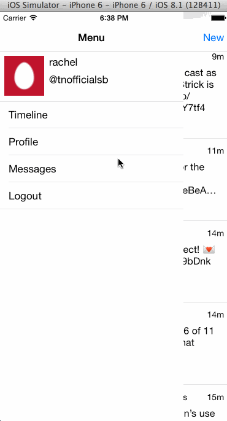

## Twitter Redux

Time spent '10 hours'

### Features

- [x] Hamburger menu
  - [x] Dragging anywhere in the view should reveal the menu.
  - [x] The menu should include links to your profile, the home timeline, and the mentions view.
  - [x] The menu can look similar to the LinkedIn menu below or feel free to take liberty with the UI.
- [x] Profile page
  - [x] Contains the user header view
  - [x] Contains a section with the users basic stats: # tweets, # following, # followers
  - [x] Optional: Implement the paging view for the user tweets and favorites.
- [x] Home Timeline
  - [x] Tapping on a user image should bring up that user's profile page

### Walkthrough

